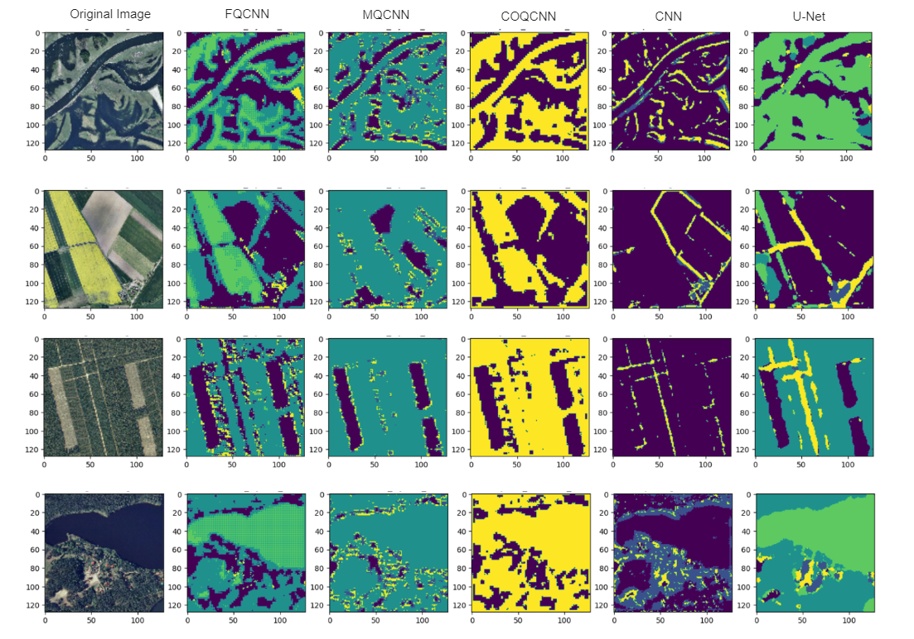

# Quantum_ML

## Description 
Acceleration of image segmentation using deep learning methods on satellite imagery has become
ubiquitous in various applications areas such as land cover classification, disaster monitoring and
vegetation detection. However, the increase of satellite image resolution and large data volume
required for remote sensing applications has resulted in a substantial increase in computational
resource usage and demand of real-time processing. In addressing these challenges, we explore
quantum computing paradigm for computationally intensive image processing. Quantum computing
has recently seen rapid growth within the image processing domain which promises to tackle the
compute needs by using its extremely parallel processing properties. This quantum paradigm involves
encoding pixel values into qubits and performing operations on the encoded data. The quantum
states are then measured to extract data and decoded back into a spatial image.
This paper explores
the application of quantum convolutional layers in remote sensing classification, comparing the
performance of several hybrid quantum models, including COQCNN, MQCNN, and FQCNN, against
a classical CNN and the U-Net architecture. The results reveal that while COQCNN and MQCNN
models underperformed, achieving accuracies of 36.65% and 39.00% respectively, the FQCNN model
demonstrated a notable improvement with an accuracy of 53.26%, outperforming the classical CNN
by 8%. Despite their faster convergence rates, the quantum models faced challenges in accurately
segmenting complex features like roads and buildings, a task where the U-Net model excelled.

## Dataset 
Dataset can be downloaded and converted to desired format using dataset_download.py file. It also contains 
the necessary functions and code to convert the images to size of 512x512 and then, split it into patches of 
128x128. The patched images will be saved into the same directory.

## Models
The file models.py contains the model architecture used for all 5 models. After training, the model parameters are saved as .pt files. There are separate jupyter notebooks
for training quantum models, named model_training_mqcnn.ipynb, model_training_coqcnn.ipynb and model_training_fqcnn.ipynb. There are separate folders for each model containing
jupyter notebooks which involve training, hyperparameter tuning and test results. 
